# Front Closing App

A personal iOS app I built while working part-time at **New York Fries** to make my front-closing shifts faster, easier to track, and less error-prone.

At my store, closing was divided into **front closing** and **back closing**. I usually handled front closing, which involved counting cash, separating till money and bank deposit money, checking sales totals, filling closing sheets, and matching POS/DSR receipt values.

The manual calculation used to take around **35 minutes**. I built this app as a pet project for my own closing workflow, and it reduced the calculation time to **under 5 minutes**. It also helped track cash clearly and reduced calculation errors significantly.

I could not publish it on the App Store because I did not have an Apple Developer account at the time, but my friends and peers at the store regularly used it from my phone during shifts.

---

## Sales, Till Money, and Bank Deposit

This was the main workflow I built the app around. During front closing, I entered the total cash sales for the day, any mid-day cash removal, and the denominations present in the cash register.

At my store, **$100 was kept permanently in the till / cash register** as the standard till float. Anything above that amount was treated as bank deposit money.

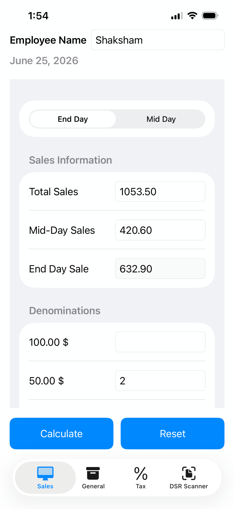

The app calculated how much money should remain in the till and how much should go into the bank deposit.

| Till Money                                                                                                             | Bank Deposit                                                                                                      |
| ---------------------------------------------------------------------------------------------------------------------- | ----------------------------------------------------------------------------------------------------------------- |
| 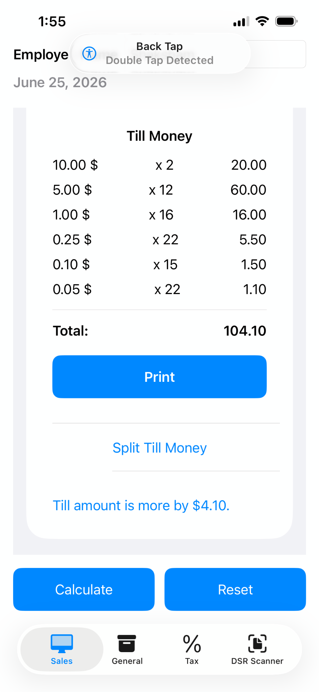 | 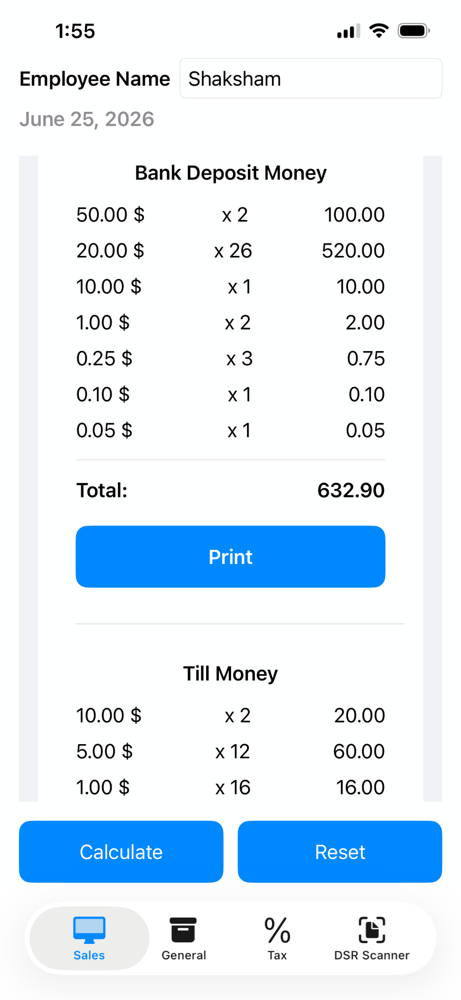 |

If the till had less than $100, the app showed how much was missing. If the till had more than $100, it helped split the extra amount from the permanent $100 till float, making the closing report easier to fill accurately.

The same information could also be printed as receipt summaries.

| Printed Till Money                                                                                                 | Printed Bank Deposit                                                                                                         |
| ------------------------------------------------------------------------------------------------------------------ | ---------------------------------------------------------------------------------------------------------------------------- |
| 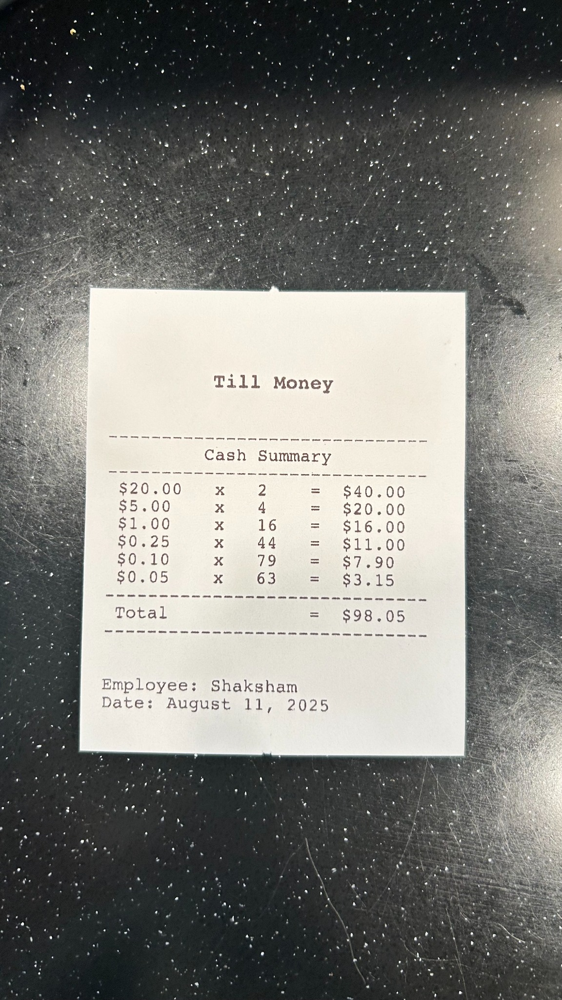 | 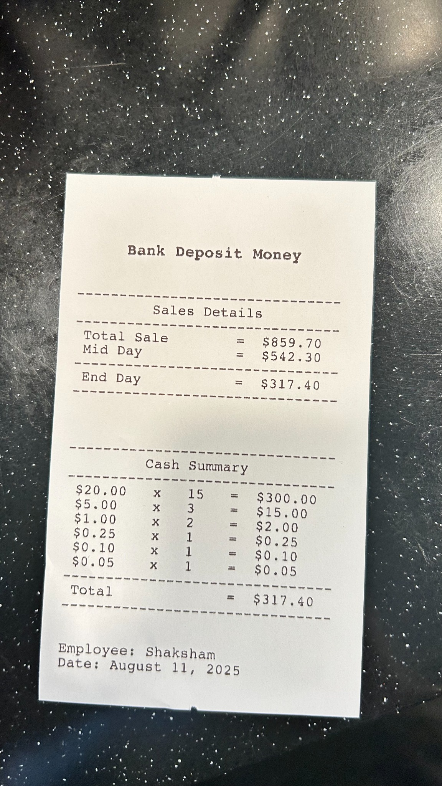 |

These values were then copied into the cash float and deposit sheet during closing.

---

## General / Multipurpose Cash Calculator

This screen was built as a simple multipurpose cash calculator for miscellaneous closing calculations. I could enter bills, individual coins, and coin bundles to quickly calculate any cash amount needed during closing.

For example, some coin rolls came from the bank as bundles, such as a $1 bundle containing 25 coins. The app let me enter both loose coins and bundled coins in the same place.

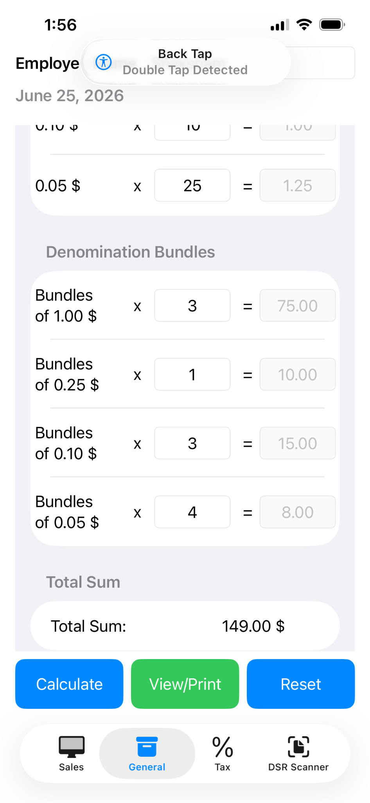

After calculating, the app showed a clean denomination summary that could be reviewed before printing.

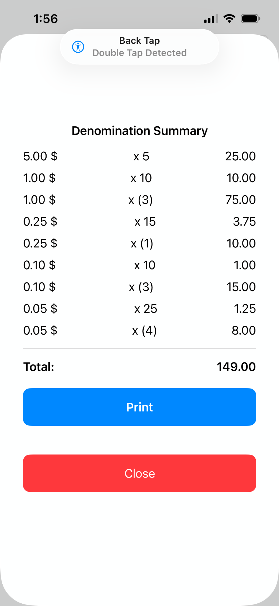

The same summary could be printed as a receipt. I could also use this for different purposes by naming the receipt, such as safe money, deposit money, or any other miscellaneous cash count.

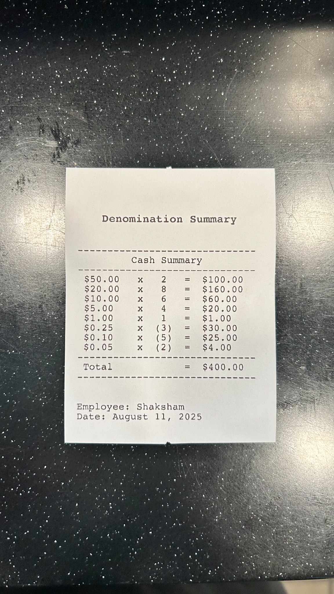

---

## DSR Scanner

This was one of the most useful features in the app. Instead of reading the sales receipt manually and filling the Daily Sales Reconciliation sheet by hand, I built a workflow that scanned the receipt, extracted the numbers, and generated the DSR in a cleaner format.

The flow started from the DSR Scanner screen. From here, I could either select a receipt from the gallery or take a fresh photo.

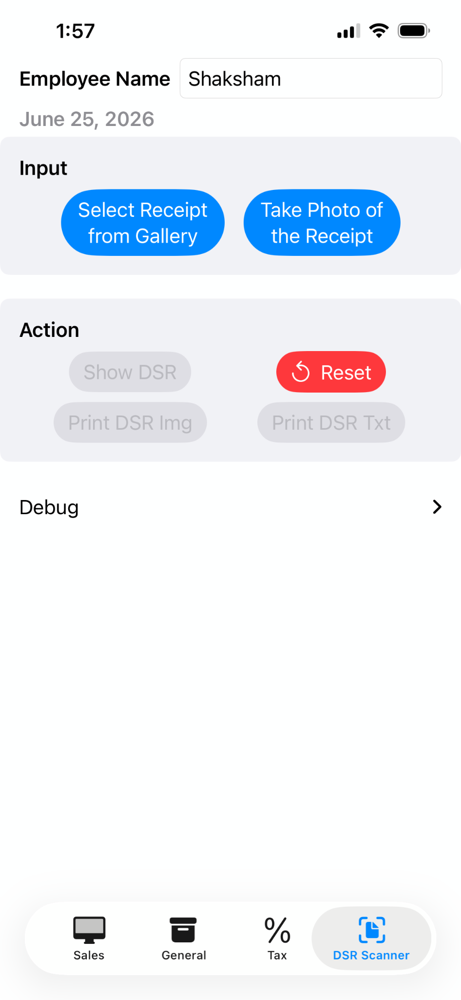

Once a receipt was loaded, the app enabled the DSR actions.

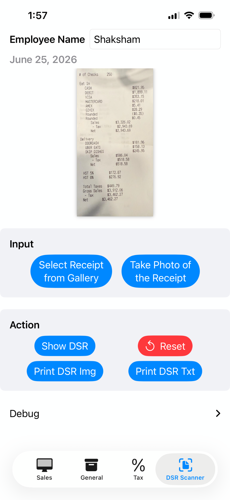

If I used the camera, the app let me capture the receipt directly.

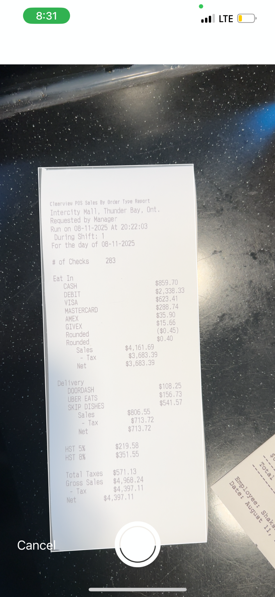

After that, the receipt could be adjusted and cropped, then reviewed before creating the report.

| Edit Scan                                                                           | Review                                                                                     |
| ----------------------------------------------------------------------------------- | ------------------------------------------------------------------------------------------ |
| 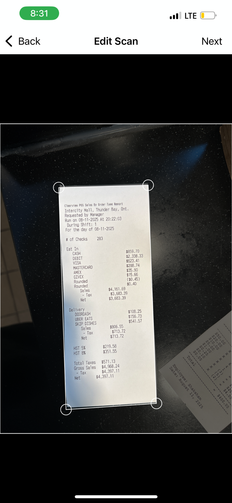 | 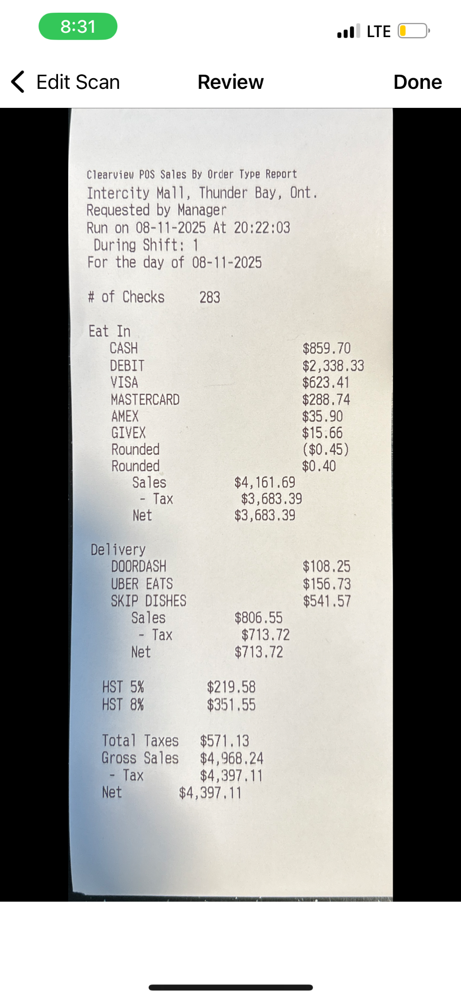 |

Once confirmed, the app created the DSR report and unlocked the final outputs.

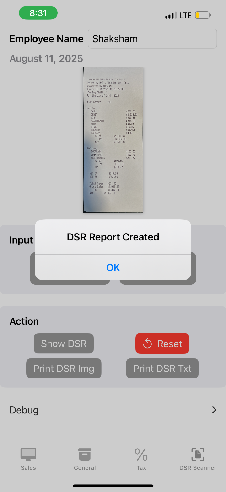

The generated DSR could then be viewed in a structured Section A and Section B format.

| Generated Section A                                                                             | Generated Section B                                                                                          |
| ----------------------------------------------------------------------------------------------- | ------------------------------------------------------------------------------------------------------------ |
| 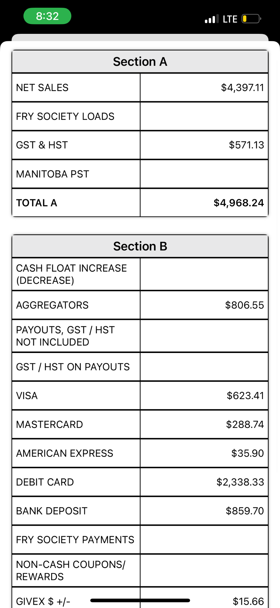 | 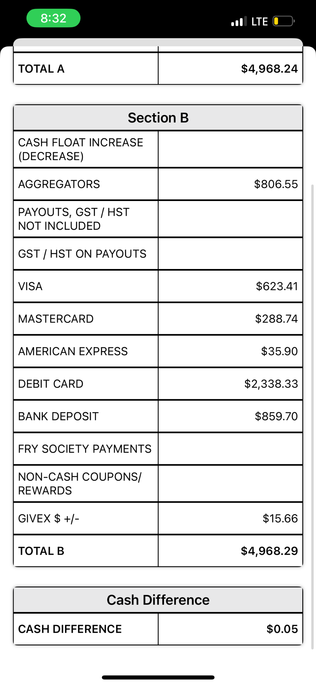 |

These values matched the paper DSR sheet that normally had to be filled during closing.

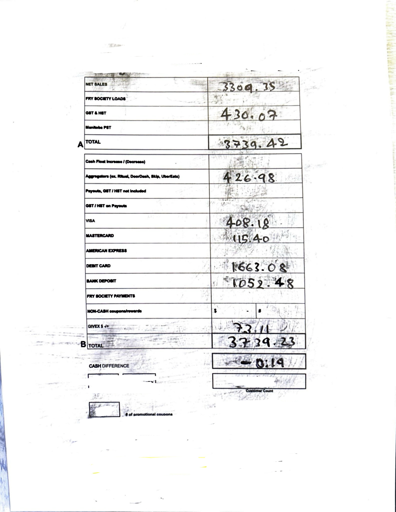

---

## Features

* Sales, till money, and bank deposit calculation
* Permanent $100 till float tracking
* Over / short cash difference check
* Multipurpose cash and coin bundle calculator
* Printable receipt summaries
* DSR receipt scanning and cropping
* OCR-based DSR value extraction
* Generated DSR report with Section A and Section B

---

## Built With

* SwiftUI
* iOS camera and photo picker
* OCR / text recognition
* Thermal receipt printer integration
